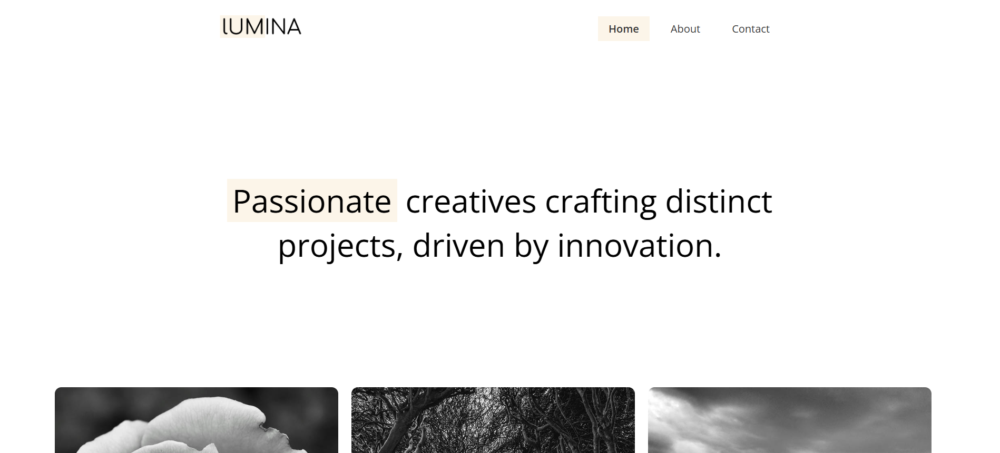

   
    
   

  

    
    
  

  <h3 align="center">Lumina Creative | Minimalistic Portfolio</h3>

   

     Lumina Creative is a minimalistic portfolio for a fictional design and photography company. It contains couple of pages that showcase all the projects done by the company, and a contact form where users can contact the company.
    

